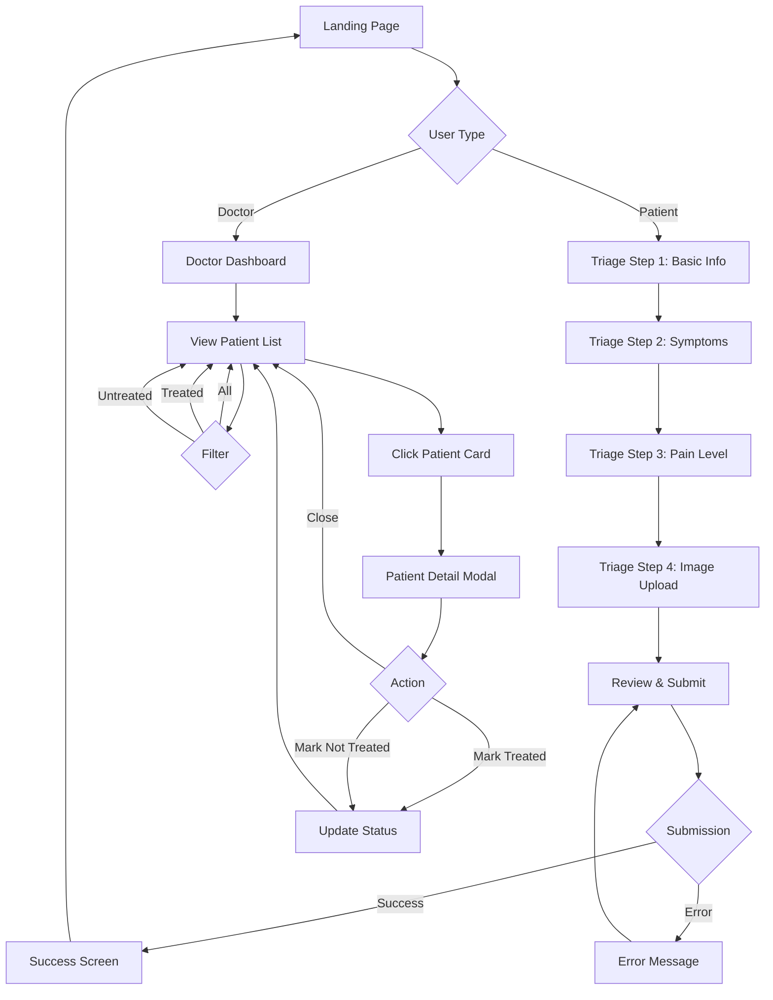

# Design Document

## Overview

NightShift MD is a full-stack emergency triage web application built with React, Tailwind CSS, and Supabase. The architecture follows a client-server model where the React frontend communicates with Supabase for data persistence, real-time updates, and file storage. The application is divided into two primary user experiences: the Patient Interface for symptom submission and the Doctor Dashboard for case management.

### Technology Stack

- **Frontend Framework**: React 18+ with functional components and hooks
- **Styling**: Tailwind CSS 3+ with custom dark theme configuration
- **Backend/Database**: Supabase (PostgreSQL database, real-time subscriptions, storage)
- **Routing**: React Router v6 for client-side navigation
- **State Management**: React Context API for global state, local state with useState/useReducer
- **Form Management**: Controlled components with custom validation logic
- **Image Handling**: Supabase Storage with client-side compression
- **Build Tool**: Vite for fast development and optimized production builds

### Design Principles

1. **Mobile-First**: All interfaces designed for mobile screens first, then enhanced for larger displays
2. **Progressive Disclosure**: Multi-step forms break complex inputs into manageable chunks
3. **Real-time First**: Leverage Supabase real-time capabilities for instant updates
4. **Accessibility**: WCAG 2.1 AA compliance with proper ARIA labels and keyboard navigation
5. **Performance**: Code splitting, lazy loading, and optimized bundle sizes
6. **Error Resilience**: Graceful degradation and clear error messaging

## Architecture

### High-Level Architecture Diagram

```
┌─────────────────────────────────────────────────────────────┐
│                     Client (Browser)                         │
│  ┌────────────────────────────────────────────────────────┐ │
│  │              React Application                          │ │
│  │  ┌──────────────────┐    ┌──────────────────┐         │ │
│  │  │ Patient Interface│    │ Doctor Dashboard │         │ │
│  │  │  - Landing       │    │  - Patient List  │         │ │
│  │  │  - Triage Form   │    │  - Detail View   │         │ │
│  │  │  - Success Page  │    │  - Filters       │         │ │
│  │  └──────────────────┘    └──────────────────┘         │ │
│  │                                                          │ │
│  │  ┌──────────────────────────────────────────────────┐  │ │
│  │  │         Shared Components & Services             │  │ │
│  │  │  - Supabase Client                               │  │ │
│  │  │  - Risk Calculator                               │  │ │
│  │  │  - UI Components (Button, Card, Badge, etc.)    │  │ │
│  │  └──────────────────────────────────────────────────┘  │ │
│  └────────────────────────────────────────────────────────┘ │
└─────────────────────────────────────────────────────────────┘
                            │
                            │ HTTPS / WebSocket
                            ▼
┌─────────────────────────────────────────────────────────────┐
│                    Supabase Backend                          │
│  ┌────────────────┐  ┌────────────────┐  ┌──────────────┐  │
│  │   PostgreSQL   │  │   Real-time    │  │   Storage    │  │
│  │   Database     │  │   Engine       │  │   (Images)   │  │
│  │  - patients    │  │  - Subscriptions│  │  - Buckets   │  │
│  └────────────────┘  └────────────────┘  └──────────────┘  │
└─────────────────────────────────────────────────────────────┘
```


### Application Flow



### Directory Structure

```
nightshift-md/
├── public/
│   └── favicon.ico
├── src/
│   ├── components/
│   │   ├── ui/
│   │   │   ├── Button.jsx
│   │   │   ├── Card.jsx
│   │   │   ├── Badge.jsx
│   │   │   ├── Input.jsx
│   │   │   ├── Select.jsx
│   │   │   ├── Modal.jsx
│   │   │   ├── LoadingSpinner.jsx
│   │   │   └── ErrorMessage.jsx
│   │   ├── patient/
│   │   │   ├── TriageStep1.jsx
│   │   │   ├── TriageStep2.jsx
│   │   │   ├── TriageStep3.jsx
│   │   │   ├── TriageStep4.jsx
│   │   │   ├── ReviewSubmit.jsx
│   │   │   └── SuccessScreen.jsx
│   │   ├── doctor/
│   │   │   ├── PatientCard.jsx
│   │   │   ├── PatientList.jsx
│   │   │   ├── PatientDetail.jsx
│   │   │   ├── FilterControls.jsx
│   │   │   └── RiskBadge.jsx
│   │   └── layout/
│   │       ├── Navbar.jsx
│   │       └── Layout.jsx
│   ├── pages/
│   │   ├── Landing.jsx
│   │   ├── PatientTriage.jsx
│   │   └── DoctorDashboard.jsx
│   ├── services/
│   │   ├── supabaseClient.js
│   │   ├── patientService.js
│   │   ├── riskCalculator.js
│   │   └── imageService.js
│   ├── hooks/
│   │   ├── usePatients.js
│   │   ├── useRealtimePatients.js
│   │   └── useImageUpload.js
│   ├── context/
│   │   └── PatientContext.jsx
│   ├── utils/
│   │   ├── validation.js
│   │   └── constants.js
│   ├── styles/
│   │   └── index.css
│   ├── App.jsx
│   └── main.jsx
├── .env.example
├── tailwind.config.js
├── vite.config.js
└── package.json
```

## Components and Interfaces

### Core Components

#### 1. UI Components (Reusable)

**Button Component**
```javascript
// Props Interface
{
  variant: 'primary' | 'secondary' | 'danger' | 'ghost',
  size: 'sm' | 'md' | 'lg',
  disabled: boolean,
  loading: boolean,
  onClick: () => void,
  children: ReactNode,
  className: string
}
```

**Card Component**
```javascript
// Props Interface
{
  children: ReactNode,
  className: string,
  onClick: () => void,
  hoverable: boolean
}
```

**Badge Component**
```javascript
// Props Interface
{
  variant: 'critical' | 'medium' | 'low' | 'treated' | 'untreated',
  children: ReactNode,
  size: 'sm' | 'md'
}
```

**Input Component**
```javascript
// Props Interface
{
  type: 'text' | 'number' | 'textarea',
  label: string,
  value: string | number,
  onChange: (value) => void,
  error: string,
  placeholder: string,
  required: boolean,
  disabled: boolean
}
```

**Modal Component**
```javascript
// Props Interface
{
  isOpen: boolean,
  onClose: () => void,
  title: string,
  children: ReactNode,
  size: 'sm' | 'md' | 'lg' | 'full'
}
```


#### 2. Patient Interface Components

**TriageStep1 Component (Basic Info)**
- Collects patient name and age
- Validates input on blur and submit
- Props: `{ formData, onUpdate, onNext }`

**TriageStep2 Component (Symptoms)**
- Large textarea for symptom description
- Character counter (10-1000 characters)
- Props: `{ formData, onUpdate, onNext, onBack }`

**TriageStep3 Component (Pain Level)**
- Three large selectable cards: Low, Medium, High
- Visual feedback on selection
- Props: `{ formData, onUpdate, onNext, onBack }`

**TriageStep4 Component (Image Upload)**
- File input with drag-and-drop support
- Image preview with remove option
- Skip button for optional upload
- Props: `{ formData, onUpdate, onNext, onBack }`

**ReviewSubmit Component**
- Displays all entered information for review
- Edit buttons for each section
- Submit button with loading state
- Props: `{ formData, onEdit, onSubmit, loading }`

**SuccessScreen Component**
- Confirmation message with patient name
- "Submit Another" button
- Props: `{ patientName, onReset }`

#### 3. Doctor Dashboard Components

**PatientCard Component**
- Displays patient summary: name, age, risk badge, treated status
- Click handler to open detail view
- Props: `{ patient, onClick }`

**PatientList Component**
- Grid/list of PatientCard components
- Handles sorting and filtering logic
- Empty state when no patients
- Props: `{ patients, filter, onPatientClick }`

**PatientDetail Component**
- Full patient information display
- Image rendering if available
- Treatment action buttons
- Props: `{ patient, onMarkTreated, onMarkNotTreated, onClose }`

**FilterControls Component**
- Three filter buttons: All, Untreated, Treated
- Active state styling
- Props: `{ activeFilter, onFilterChange }`

**RiskBadge Component**
- Color-coded badge based on risk level
- Props: `{ riskLevel }`

### Service Layer

#### Supabase Client Service

```javascript
// supabaseClient.js
import { createClient } from '@supabase/supabase-js'

const supabaseUrl = import.meta.env.VITE_SUPABASE_URL
const supabaseAnonKey = import.meta.env.VITE_SUPABASE_ANON_KEY

export const supabase = createClient(supabaseUrl, supabaseAnonKey)
```

#### Patient Service

```javascript
// patientService.js
export const patientService = {
  // Create new patient record
  async createPatient(patientData) {
    const { data, error } = await supabase
      .from('patients')
      .insert([patientData])
      .select()
    return { data, error }
  },

  // Fetch all patients with optional filter
  async getPatients(filter = 'all') {
    let query = supabase
      .from('patients')
      .select('*')
      .order('created_at', { ascending: false })
    
    if (filter === 'treated') {
      query = query.eq('treated', true)
    } else if (filter === 'untreated') {
      query = query.eq('treated', false)
    }
    
    const { data, error } = await query
    return { data, error }
  },

  // Update treatment status
  async updateTreatmentStatus(patientId, treated) {
    const { data, error } = await supabase
      .from('patients')
      .update({ treated })
      .eq('id', patientId)
      .select()
    return { data, error }
  },

  // Subscribe to real-time changes
  subscribeToPatients(callback) {
    return supabase
      .channel('patients-channel')
      .on('postgres_changes', 
        { event: '*', schema: 'public', table: 'patients' },
        callback
      )
      .subscribe()
  }
}
```

#### Risk Calculator Service

```javascript
// riskCalculator.js
export const calculateRiskLevel = (symptoms, painLevel) => {
  const criticalKeywords = ['chest pain', 'bleeding', 'severe', 'unconscious']
  const symptomsLower = symptoms.toLowerCase()
  
  // Check for critical keywords
  const hasCriticalSymptom = criticalKeywords.some(keyword => 
    symptomsLower.includes(keyword)
  )
  
  if (hasCriticalSymptom || painLevel === 'High') {
    return 'Critical'
  }
  
  if (painLevel === 'Medium') {
    return 'Medium'
  }
  
  return 'Low'
}
```

#### Image Service

```javascript
// imageService.js
export const imageService = {
  // Upload image to Supabase Storage
  async uploadImage(file, patientId) {
    const fileExt = file.name.split('.').pop()
    const fileName = `${patientId}-${Date.now()}.${fileExt}`
    const filePath = `patient-images/${fileName}`
    
    const { data, error } = await supabase.storage
      .from('patient-images')
      .upload(filePath, file)
    
    if (error) return { data: null, error }
    
    const { data: { publicUrl } } = supabase.storage
      .from('patient-images')
      .getPublicUrl(filePath)
    
    return { data: publicUrl, error: null }
  },

  // Validate image file
  validateImage(file) {
    const maxSize = 5 * 1024 * 1024 // 5MB
    const allowedTypes = ['image/jpeg', 'image/png', 'image/webp']
    
    if (file.size > maxSize) {
      return { valid: false, error: 'File size must be less than 5MB' }
    }
    
    if (!allowedTypes.includes(file.type)) {
      return { valid: false, error: 'Only JPEG, PNG, and WebP formats are allowed' }
    }
    
    return { valid: true, error: null }
  }
}
```


### Custom Hooks

#### usePatients Hook

```javascript
// usePatients.js
export const usePatients = (filter = 'all') => {
  const [patients, setPatients] = useState([])
  const [loading, setLoading] = useState(true)
  const [error, setError] = useState(null)

  useEffect(() => {
    fetchPatients()
  }, [filter])

  const fetchPatients = async () => {
    setLoading(true)
    const { data, error } = await patientService.getPatients(filter)
    
    if (error) {
      setError(error.message)
    } else {
      setPatients(sortPatientsByRisk(data))
    }
    
    setLoading(false)
  }

  const sortPatientsByRisk = (patients) => {
    const riskOrder = { 'Critical': 0, 'Medium': 1, 'Low': 2 }
    return patients.sort((a, b) => {
      const riskDiff = riskOrder[a.risk_level] - riskOrder[b.risk_level]
      if (riskDiff !== 0) return riskDiff
      return new Date(b.created_at) - new Date(a.created_at)
    })
  }

  return { patients, loading, error, refetch: fetchPatients }
}
```

#### useRealtimePatients Hook

```javascript
// useRealtimePatients.js
export const useRealtimePatients = (initialPatients) => {
  const [patients, setPatients] = useState(initialPatients)

  useEffect(() => {
    const subscription = patientService.subscribeToPatients((payload) => {
      if (payload.eventType === 'INSERT') {
        setPatients(prev => sortPatientsByRisk([payload.new, ...prev]))
      } else if (payload.eventType === 'UPDATE') {
        setPatients(prev => 
          prev.map(p => p.id === payload.new.id ? payload.new : p)
        )
      } else if (payload.eventType === 'DELETE') {
        setPatients(prev => prev.filter(p => p.id !== payload.old.id))
      }
    })

    return () => {
      subscription.unsubscribe()
    }
  }, [])

  return patients
}
```

#### useImageUpload Hook

```javascript
// useImageUpload.js
export const useImageUpload = () => {
  const [uploading, setUploading] = useState(false)
  const [error, setError] = useState(null)

  const uploadImage = async (file, patientId) => {
    setUploading(true)
    setError(null)

    const validation = imageService.validateImage(file)
    if (!validation.valid) {
      setError(validation.error)
      setUploading(false)
      return { url: null, error: validation.error }
    }

    const { data, error } = await imageService.uploadImage(file, patientId)
    
    if (error) {
      setError(error.message)
    }
    
    setUploading(false)
    return { url: data, error }
  }

  return { uploadImage, uploading, error }
}
```

## Data Models

### Patient Data Model

```typescript
interface Patient {
  id: string              // UUID, auto-generated by Supabase
  name: string            // 2-100 characters
  age: number             // 0-150
  symptoms: string        // 10-1000 characters
  pain_level: 'Low' | 'Medium' | 'High'
  risk_level: 'Low' | 'Medium' | 'Critical'  // Calculated
  image: string | null    // Supabase Storage URL or null
  treated: boolean        // Default: false
  created_at: string      // ISO timestamp, auto-generated
}
```

### Form State Model (Patient Interface)

```typescript
interface TriageFormData {
  name: string
  age: number | ''
  symptoms: string
  painLevel: 'Low' | 'Medium' | 'High' | ''
  imageFile: File | null
  imagePreview: string | null
}

interface FormErrors {
  name?: string
  age?: string
  symptoms?: string
  painLevel?: string
  image?: string
}
```

### Dashboard State Model

```typescript
interface DashboardState {
  patients: Patient[]
  filter: 'all' | 'treated' | 'untreated'
  selectedPatient: Patient | null
  loading: boolean
  error: string | null
}
```

## Supabase Schema

### Database Table: patients

```sql
CREATE TABLE patients (
  id UUID PRIMARY KEY DEFAULT uuid_generate_v4(),
  name TEXT NOT NULL CHECK (char_length(name) >= 2 AND char_length(name) <= 100),
  age INTEGER NOT NULL CHECK (age >= 0 AND age <= 150),
  symptoms TEXT NOT NULL CHECK (char_length(symptoms) >= 10 AND char_length(symptoms) <= 1000),
  pain_level TEXT NOT NULL CHECK (pain_level IN ('Low', 'Medium', 'High')),
  risk_level TEXT NOT NULL CHECK (risk_level IN ('Low', 'Medium', 'Critical')),
  image TEXT,
  treated BOOLEAN DEFAULT FALSE,
  created_at TIMESTAMP WITH TIME ZONE DEFAULT NOW()
);

-- Index for faster sorting and filtering
CREATE INDEX idx_patients_risk_created ON patients(risk_level, created_at DESC);
CREATE INDEX idx_patients_treated ON patients(treated);
```

### Storage Bucket: patient-images

```javascript
// Bucket configuration
{
  name: 'patient-images',
  public: true,
  fileSizeLimit: 5242880, // 5MB
  allowedMimeTypes: ['image/jpeg', 'image/png', 'image/webp']
}
```

### Real-time Configuration

Enable real-time for the patients table:
```sql
ALTER PUBLICATION supabase_realtime ADD TABLE patients;
```


## User Interface Design

### Design System

#### Color Palette

```javascript
// tailwind.config.js theme extension
colors: {
  primary: {
    bg: '#0A1A2F',      // Main background
    card: '#0F2744',    // Card background
    border: '#1A3A5C',  // Borders
  },
  accent: {
    primary: '#00E5A5',  // Main accent (neon green)
    hover: '#00CC94',    // Hover state
    light: '#33EEBB',    // Light variant
  },
  text: {
    primary: '#FFFFFF',   // Primary text
    secondary: '#E5E7EB', // Secondary text
    muted: '#9CA3AF',     // Muted text
  },
  risk: {
    critical: '#EF4444',  // Red
    medium: '#F59E0B',    // Yellow/Orange
    low: '#10B981',       // Green
  },
  status: {
    treated: '#6366F1',   // Indigo
    untreated: '#6B7280', // Gray
  }
}
```

#### Typography

```javascript
fontFamily: {
  sans: ['Inter', 'system-ui', 'sans-serif'],
  mono: ['JetBrains Mono', 'monospace'],
}

fontSize: {
  xs: '0.75rem',    // 12px
  sm: '0.875rem',   // 14px
  base: '1rem',     // 16px
  lg: '1.125rem',   // 18px
  xl: '1.25rem',    // 20px
  '2xl': '1.5rem',  // 24px
  '3xl': '1.875rem',// 30px
  '4xl': '2.25rem', // 36px
}
```

#### Spacing & Sizing

```javascript
borderRadius: {
  sm: '0.375rem',  // 6px
  md: '0.5rem',    // 8px
  lg: '0.75rem',   // 12px
  xl: '1rem',      // 16px
}

boxShadow: {
  card: '0 4px 6px -1px rgba(0, 0, 0, 0.2)',
  modal: '0 20px 25px -5px rgba(0, 0, 0, 0.3)',
  glow: '0 0 20px rgba(0, 229, 165, 0.15)',
}
```

### Screen Designs

#### 1. Landing Page

**Layout:**
- Full-screen hero section with dark gradient background
- Centered content with app logo/title
- Two large CTA buttons: "I'm a Patient" and "I'm a Doctor"
- Minimal footer with app version

**Visual Elements:**
- Subtle animated background pattern
- Large heading: "NightShift MD"
- Subheading: "Emergency Triage System"
- Buttons with accent color and hover effects

#### 2. Patient Triage - Step 1 (Basic Info)

**Layout:**
- Progress indicator at top (Step 1 of 4)
- Card container with form fields
- Name input (text)
- Age input (number)
- "Next" button at bottom

**Validation:**
- Real-time error messages below fields
- Disabled "Next" button until valid

#### 3. Patient Triage - Step 2 (Symptoms)

**Layout:**
- Progress indicator (Step 2 of 4)
- Large textarea for symptoms
- Character counter (10/1000)
- "Back" and "Next" buttons

**Visual Elements:**
- Expandable textarea
- Placeholder text with examples
- Error state for < 10 characters

#### 4. Patient Triage - Step 3 (Pain Level)

**Layout:**
- Progress indicator (Step 3 of 4)
- Three large selectable cards in a row (mobile: stacked)
  - Low (green accent)
  - Medium (yellow accent)
  - High (red accent)
- Each card has icon and description
- "Back" and "Next" buttons

**Interaction:**
- Selected card has border glow and scale effect
- Unselected cards are dimmed

#### 5. Patient Triage - Step 4 (Image Upload)

**Layout:**
- Progress indicator (Step 4 of 4)
- Drag-and-drop zone or file input
- Image preview if selected
- "Remove" button for selected image
- "Skip" and "Next" buttons

**Visual Elements:**
- Dashed border for drop zone
- Thumbnail preview (max 300px)
- File size and format info text

#### 6. Review & Submit Screen

**Layout:**
- Summary card with all entered data
- Sections: Basic Info, Symptoms, Pain Level, Image
- "Edit" button for each section
- Large "Submit" button at bottom
- "Back" button

**Visual Elements:**
- Read-only display of all data
- Loading spinner on submit button when processing

#### 7. Success Screen

**Layout:**
- Large success icon (checkmark)
- Confirmation message: "Thank you, [Name]!"
- Subtext: "Your information has been submitted. A doctor will review your case shortly."
- "Submit Another Case" button
- "Return to Home" button

**Visual Elements:**
- Accent color for success icon
- Centered content
- Animated entrance

#### 8. Doctor Dashboard - Patient List

**Layout:**
- Top navigation bar with app title and refresh button
- Filter controls (All, Untreated, Treated)
- Grid of patient cards (3 columns desktop, 1 column mobile)
- Each card shows:
  - Risk badge (top-right corner)
  - Patient name (large)
  - Age
  - Submission time (relative, e.g., "5 minutes ago")
  - Treated status badge

**Visual Elements:**
- Cards have hover effect (slight scale and glow)
- Risk badges are prominent with color coding
- Empty state with illustration when no patients

#### 9. Patient Detail Modal

**Layout:**
- Full-screen overlay on mobile, centered modal on desktop
- Close button (X) in top-right
- Patient information sections:
  - Header: Name, Age, Risk Badge
  - Symptoms (scrollable if long)
  - Pain Level
  - Image (if available, max 800px width)
  - Submission timestamp
  - Treatment status
- Action buttons at bottom:
  - "Mark as Treated" (if untreated)
  - "Mark as Not Treated" (if treated)

**Visual Elements:**
- Modal has dark background with border
- Image has rounded corners and shadow
- Action buttons change based on current status

#### 10. Loading States

**Variations:**
- Full-page spinner for initial data load
- Skeleton cards for patient list loading
- Button spinner for form submission
- Inline spinner for image upload

#### 11. Error States

**Variations:**
- Form validation errors (red text below fields)
- Network error banner at top of screen
- Empty state for no patients
- Failed image upload message

### Responsive Breakpoints

```javascript
screens: {
  'sm': '640px',   // Mobile landscape
  'md': '768px',   // Tablet
  'lg': '1024px',  // Desktop
  'xl': '1280px',  // Large desktop
}
```

**Mobile (<768px):**
- Single column layouts
- Stacked form fields
- Full-screen modals
- Larger touch targets (min 44x44px)
- Bottom-fixed action buttons

**Tablet (768px-1023px):**
- Two-column patient card grid
- Side-by-side form fields where appropriate
- Modal with max-width 600px

**Desktop (1024px+):**
- Three-column patient card grid
- Centered modal with max-width 800px
- Hover states enabled


## Routing Structure

```javascript
// React Router configuration
const routes = [
  {
    path: '/',
    element: <Landing />
  },
  {
    path: '/patient/triage',
    element: <PatientTriage />
  },
  {
    path: '/doctor/dashboard',
    element: <DoctorDashboard />
  },
  {
    path: '*',
    element: <NotFound />
  }
]
```

## Error Handling

### Error Categories

1. **Validation Errors**
   - Display inline below form fields
   - Prevent form submission
   - Clear on user correction

2. **Network Errors**
   - Display toast notification or banner
   - Provide retry mechanism
   - Log to console for debugging

3. **Supabase Errors**
   - Database connection failures
   - Query errors
   - Storage upload failures
   - Display user-friendly messages
   - Offer retry or alternative actions

4. **Image Upload Errors**
   - File size exceeded
   - Invalid file type
   - Upload failure
   - Display specific error message
   - Allow user to select different file

### Error Handling Strategy

```javascript
// Centralized error handler
export const handleError = (error, context) => {
  console.error(`Error in ${context}:`, error)
  
  // Map technical errors to user-friendly messages
  const errorMessages = {
    'Failed to fetch': 'Unable to connect. Please check your internet connection.',
    'duplicate key': 'This record already exists.',
    'foreign key': 'Related data not found.',
    'not null': 'Required field is missing.',
  }
  
  for (const [key, message] of Object.entries(errorMessages)) {
    if (error.message.includes(key)) {
      return message
    }
  }
  
  return 'An unexpected error occurred. Please try again.'
}
```

### Loading States

```javascript
// Loading state patterns
const LoadingStates = {
  IDLE: 'idle',
  LOADING: 'loading',
  SUCCESS: 'success',
  ERROR: 'error'
}

// Usage in components
const [status, setStatus] = useState(LoadingStates.IDLE)
```

## Testing Strategy

### Unit Tests

**Components to Test:**
- Risk calculator logic
- Form validation functions
- Data sorting and filtering
- Image validation

**Testing Framework:** Vitest + React Testing Library

**Example Test Cases:**
```javascript
describe('Risk Calculator', () => {
  test('assigns Critical for chest pain symptom', () => {
    expect(calculateRiskLevel('chest pain', 'Low')).toBe('Critical')
  })
  
  test('assigns Critical for High pain level', () => {
    expect(calculateRiskLevel('headache', 'High')).toBe('Critical')
  })
  
  test('assigns Medium for Medium pain level', () => {
    expect(calculateRiskLevel('headache', 'Medium')).toBe('Medium')
  })
  
  test('assigns Low for Low pain level without critical keywords', () => {
    expect(calculateRiskLevel('headache', 'Low')).toBe('Low')
  })
})
```

### Integration Tests

**Scenarios to Test:**
- Complete patient triage flow
- Doctor dashboard patient list rendering
- Treatment status update flow
- Real-time update handling
- Image upload and display

### End-to-End Tests

**Framework:** Playwright or Cypress

**Critical User Flows:**
1. Patient submits triage form successfully
2. Doctor views new patient in dashboard
3. Doctor marks patient as treated
4. Real-time update reflects in UI

### Manual Testing Checklist

- [ ] Mobile responsiveness on iOS Safari
- [ ] Mobile responsiveness on Android Chrome
- [ ] Desktop browsers (Chrome, Firefox, Safari, Edge)
- [ ] Form validation edge cases
- [ ] Image upload with various file sizes
- [ ] Network failure scenarios
- [ ] Real-time updates with multiple tabs
- [ ] Accessibility with screen reader
- [ ] Keyboard navigation

## Performance Optimization

### Code Splitting

```javascript
// Lazy load routes
const Landing = lazy(() => import('./pages/Landing'))
const PatientTriage = lazy(() => import('./pages/PatientTriage'))
const DoctorDashboard = lazy(() => import('./pages/DoctorDashboard'))
```

### Image Optimization

- Client-side compression before upload
- Lazy loading for patient images
- Responsive image sizes
- WebP format preference

### Bundle Optimization

- Tree shaking unused code
- Minimize dependencies
- Use production builds
- Enable gzip compression

### Database Optimization

- Indexed queries for sorting
- Limit query results with pagination (future enhancement)
- Efficient real-time subscriptions

## Security Considerations

### Data Validation

- Client-side validation for UX
- Server-side validation via Supabase constraints
- SQL injection prevention (Supabase handles this)

### Authentication (Future Enhancement)

- Doctor dashboard should require authentication
- Row-level security policies in Supabase
- Secure session management

### Data Privacy

- No PHI (Protected Health Information) beyond necessary fields
- HTTPS only in production
- Secure image storage with access controls

### Input Sanitization

- Escape user input before display
- Prevent XSS attacks
- Validate file uploads

## Accessibility

### WCAG 2.1 AA Compliance

- Semantic HTML elements
- ARIA labels for interactive elements
- Keyboard navigation support
- Focus indicators
- Color contrast ratios (minimum 4.5:1)
- Alt text for images
- Form labels and error associations

### Keyboard Navigation

- Tab order follows logical flow
- Enter key submits forms
- Escape key closes modals
- Arrow keys for selection (pain level cards)

### Screen Reader Support

- Descriptive button labels
- Status announcements for form submission
- Error message announcements
- Loading state announcements

## Deployment Strategy

### Environment Variables

```bash
# .env.example
VITE_SUPABASE_URL=your_supabase_url
VITE_SUPABASE_ANON_KEY=your_supabase_anon_key
```

### Build Process

```bash
# Install dependencies
npm install

# Development server
npm run dev

# Production build
npm run build

# Preview production build
npm run preview
```

### Hosting Options

**Recommended: Vercel or Netlify**
- Automatic deployments from Git
- Edge network CDN
- HTTPS by default
- Environment variable management

**Configuration:**
- Build command: `npm run build`
- Output directory: `dist`
- Node version: 18+

### Supabase Setup

1. Create new Supabase project
2. Run SQL schema creation
3. Create storage bucket for patient-images
4. Enable real-time for patients table
5. Configure RLS policies (if authentication added)
6. Copy project URL and anon key to environment variables

### Pre-deployment Checklist

- [ ] Environment variables configured
- [ ] Supabase schema created
- [ ] Storage bucket created and configured
- [ ] Real-time enabled
- [ ] Production build tested locally
- [ ] Error tracking configured (e.g., Sentry)
- [ ] Analytics configured (optional)
- [ ] Domain configured
- [ ] SSL certificate active

## Monitoring and Maintenance

### Logging

- Console errors in development
- Error tracking service in production (Sentry recommended)
- Supabase logs for database queries

### Analytics (Optional)

- Page view tracking
- Form submission success rate
- Average triage completion time
- Doctor dashboard usage metrics

### Maintenance Tasks

- Regular dependency updates
- Security patch monitoring
- Database backup verification
- Storage usage monitoring
- Performance monitoring

## Future Enhancements

### Phase 2 Features

1. **Doctor Authentication**
   - Login system for doctors
   - Role-based access control
   - Audit logs

2. **Patient Search**
   - Search by name or ID
   - Advanced filtering options

3. **Pagination**
   - Load patients in batches
   - Infinite scroll or page numbers

4. **Patient History**
   - View previous visits
   - Track treatment outcomes

5. **Notifications**
   - Email/SMS alerts for critical cases
   - Push notifications for doctors

6. **Export Functionality**
   - Export patient data to CSV
   - Generate reports

7. **Multi-language Support**
   - Internationalization (i18n)
   - Language selector

8. **Dark/Light Mode Toggle**
   - User preference storage
   - System preference detection

9. **Advanced Risk Assessment**
   - Machine learning model
   - More sophisticated algorithms

10. **Telemedicine Integration**
    - Video consultation
    - Chat functionality

## Edge Cases and Handling

### Patient Interface Edge Cases

1. **User navigates away mid-form**
   - Solution: Save form state to localStorage
   - Restore on return with prompt

2. **Network drops during submission**
   - Solution: Retry mechanism with exponential backoff
   - Show clear error message

3. **Image upload fails**
   - Solution: Allow submission without image
   - Provide retry option

4. **Duplicate submissions**
   - Solution: Disable submit button after click
   - Show loading state

5. **Very long symptom descriptions**
   - Solution: Enforce 1000 character limit
   - Show character counter

### Doctor Dashboard Edge Cases

1. **No patients in database**
   - Solution: Show empty state with helpful message

2. **Real-time connection drops**
   - Solution: Fallback to polling every 30 seconds
   - Show connection status indicator

3. **Concurrent updates by multiple doctors**
   - Solution: Optimistic UI updates
   - Handle conflicts gracefully

4. **Large number of patients (100+)**
   - Solution: Implement pagination
   - Virtual scrolling for performance

5. **Patient image fails to load**
   - Solution: Show placeholder image
   - Provide retry button

### Data Edge Cases

1. **Invalid data in database**
   - Solution: Validate on read
   - Log errors for investigation

2. **Missing required fields**
   - Solution: Database constraints prevent this
   - Handle gracefully if occurs

3. **Timestamp timezone issues**
   - Solution: Store in UTC
   - Display in user's local timezone

## Technical Debt and Known Limitations

### Current Limitations

1. No authentication for doctor dashboard (security risk)
2. No pagination (performance issue with many patients)
3. No offline support
4. Limited error recovery options
5. No audit trail for treatment status changes

### Planned Improvements

1. Implement proper authentication system
2. Add comprehensive error boundary components
3. Improve real-time connection resilience
4. Add unit test coverage to 80%+
5. Implement proper logging and monitoring

## Conclusion

This design document provides a comprehensive blueprint for building NightShift MD. The architecture prioritizes simplicity, real-time capabilities, and mobile-first design while maintaining extensibility for future enhancements. The modular component structure and clear separation of concerns will facilitate maintenance and feature additions.
